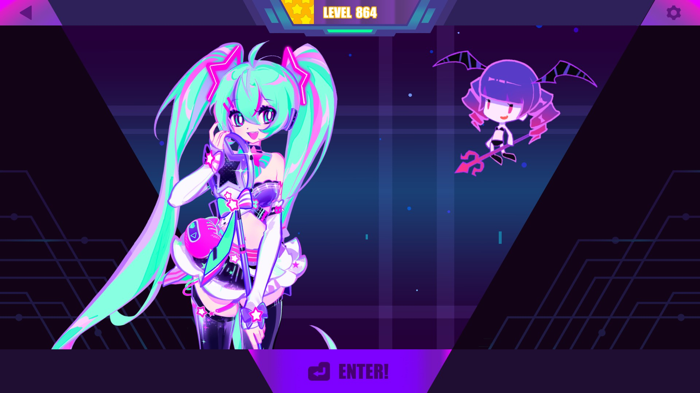

# SkipLogo

Skip the welcome sequence.

## ❗Check out my other [mods](https://github.com/Asgragrt/AsgraMDMods/blob/main/README.md)❗

## Settings

The config file can be found at `${Your muse dash folder}/UserData/PeroPeroSkip.cfg`

* ``SkipToHome`` skips all the way to [home](#home).
* ``SkipToWelcome`` skips only up to the [welcome screen](#welcome).
* ``DebugLog`` enables debug messages.

## Installation

### Prerequisites

* Make sure you have `MelonLoader 0.6.1` or higher installed and working on your Muse Dash.

### Steps

1. Download the latest release from [releases](https://github.com/Asgragrt/PeroPeroSkip/releases/latest).
2. Move `PeroPeroSkip.dll` to `${Your muse dash folder}/Mods`.
3. Enable / Disable the mod from the configuration file found at `${Your muse dash folder}/UserData/PeroPeroSkip.cfg`.

## Scenes

### Home

### Welcome

